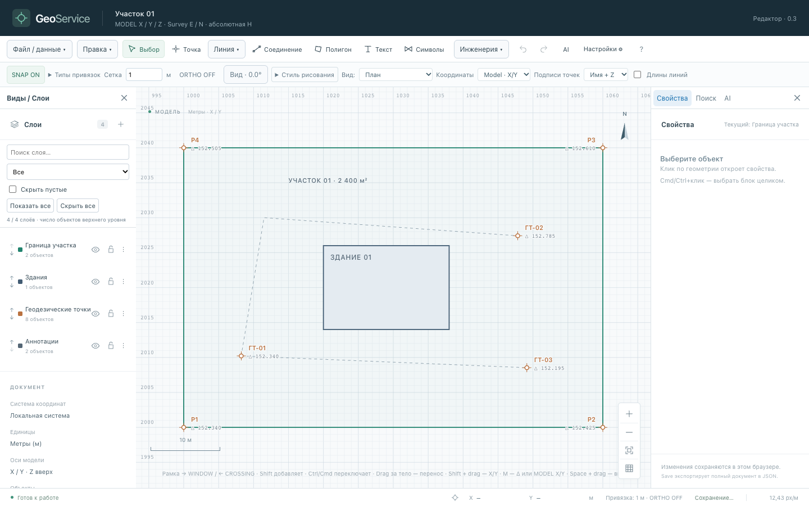
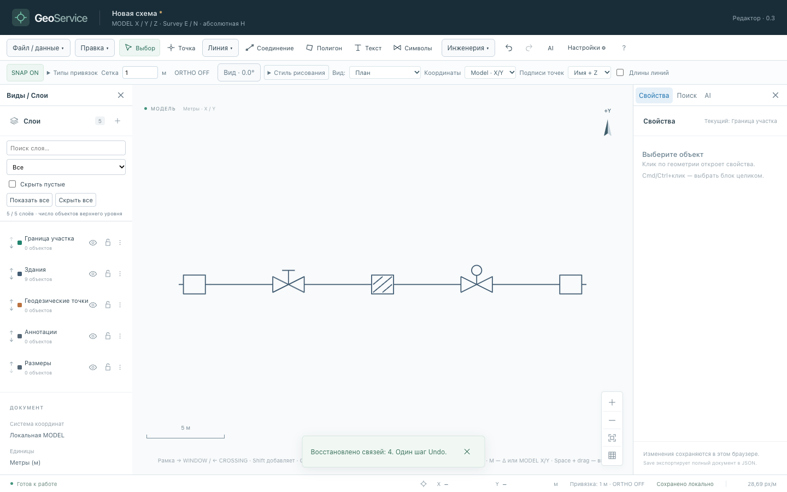
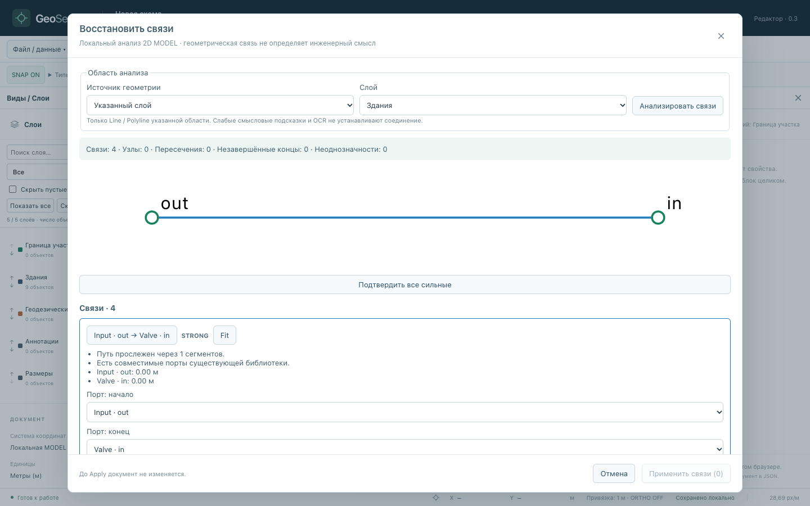

# GeoService

**Локальный браузерный CAD-редактор геодезических и технологических схем.**
Импортируйте координаты, DXF, PDF или скан, редактируйте геометрию, ставьте размеры,
собирайте схемы из символов и восстанавливайте проверенные связи между ними.
AI переводит текстовый запрос в план; геометрия вычисляется и применяется в браузере после вашего подтверждения.

**[GitHub Pages](https://spnkd.github.io/GeoService/)** · **[GitVerse Pages](https://spnkd.gitverse.site/geoservice/)** ·
[GitHub](https://github.com/SpNkd/GeoService) · [GitVerse](https://gitverse.ru/spnkd/GeoService) · [MIT](LICENSE)



## Для чего это нужно

- Быстро построить и проверить участок, контур здания или ход по геодезическим точкам.
- Просматривать DXF с исходными слоями, блоками, Paper Space и MODEL viewport; редактировать поддерживаемые канонические объекты.
- Превратить выбранную страницу PDF или контрастный скан в проверенную редактируемую геометрию, текст и библиотечные символы.
- Собрать технологическую схему из Symbol + Port + Connector или восстановить подходящие связи из существующих Line/Polyline.
- Обозначить собственные смысловые категории и находить объекты локально через Search / «Научить GeoService».

Это развивающийся редактор схем, а не замена полной CAD/BIM-системы или средство нормативного проектирования.
Геометрическая связь не определяет среду, давление, диаметр или инженерную правильность.

## Попробовать за пять минут

1. Откройте приложение: при первом запуске появится демонстрационный участок со зданием и точками.
2. Колесом приблизьте чертёж; **Space + drag** перемещает вид, **F** вписывает схему.
3. Выберите контур или точку. Справа откройте **Свойства**; измените координаты или перетащите объект. **Ctrl/Cmd+Z** отменяет действие.
4. Через **Файл / данные** импортируйте CSV/координаты из Excel, DXF, PDF или подложку. До Apply проверьте preview, единицы и целевой слой.
5. **Save** скачивает JSON. **Open** восстанавливает его. Автосохранение работает в IndexedDB текущего браузера; для переносимой копии используйте Save.

Чертежи разных доменов и браузеров хранятся отдельно. JSON сохраняет геометрию и метаданные;
исходные растровые файлы при переносе могут потребовать повторной привязки. История Undo не переносится после reload.

## Рисование и навигация

| Действие | Управление |
| --- | --- |
| Выбрать / добавить к выбору | клик / Shift + клик |
| Панорама / масштаб | Space + drag / колесо |
| Вписать схему | F или ZE |
| Линия / полилиния / полигон | L / PL / POL; Enter завершает контур |
| Точка / текст / размер / измерение | PO / T / DIM / DI |
| Переместить выбор точно | M: Relative Δ или Absolute MODEL X/Y |
| Отмена / повтор | Ctrl/Cmd+Z / Ctrl/Cmd+Shift+Z |
| Завершить popup или отменить текущий шаг | Escape |
| Полный справочник | ? |

Текстовые поля сохраняют обычный ввод. Выбор опции мышью возвращает контекст редактора для Space-pan.
Слои можно скрывать, блокировать и переименовывать. Plan с поворотом и Axonometric — независимые виды;
навигация **DXF Views** различает Model, листы Paper Space и MODEL viewports внутри листа.

## Основные возможности

- Редактор: Point/Line/Polyline/Polygon, Arc/Circle, Text/Labels, Dimensions/Measure, Move/Rotate, SNAP/grid/ORTHO, marquee, Layers, styles/ByLayer, Match Properties.
- DXF: Model, Paper Space и MODEL viewports, VP Freeze отдельно от глобальных слоёв, shared/nested blocks, просмотр примитивов, instance ATTRIB, локальный поиск/таблицы/provenance.
- PDF: векторные, сканированные и смешанные страницы, native geometry/text, выбор страницы.
- Изображения: коррекция перспективы/deskew/масштаб, векторизация и примитивы, OCR RU/EN и библиотечные символы с ручным review.
- Схемы: Symbol Library, Ports, Connectors, объяснимое восстановление подходящих связей.
- AI: Spatial AI/relative constraints/clarification, Document Operations и Process Schemes; Semantic Learning хранит подтверждённые пользователем категории локально.
- Виды: Plan, поворот/North Up, Axonometric, Paper Space; локальные autosave/Save/Open/Preferences.

## Символы и восстановление связей



[Скачать синтетическую схему](public/examples/process-scheme.json) и загрузить через **Open**.

**Символы** открывает локальную библиотеку. Инструмент **Соединение / CO** связывает совместимые свободные порты;
связи следуют за перемещением, поворотом и масштабом символов.

Для изображения: **Подложка → Векторизация изображения** → коррекция/масштаб → извлечение → локальное OCR/распознавание → review → Apply.
Для native PDF выберите страницу и **Распознать символы из векторов**. Неизвестные или неоднозначные формы назначаются вручную.

Затем **Правка → Восстановить связи**:

1. Выберите область: выделенные Line/Polyline, слой, подтверждённую категорию, прямоугольник или группу импорта.
2. Запустите локальный анализ; просмотрите путь, порты, T/X пересечения, разрывы и свободные окончания.
3. Подтвердите подходящие связи, уточните порт/пересечение или оставьте объект геометрией. Bulk принимает только подходящие STRONG связи.
4. **Применить связи** создаёт обычные Connector одной операцией Undo. Сложные пути и ветвления, форму которых текущий Connector не сохраняет, остаются Line/Polyline.



## Подключение AI

Без ключа редактор работает полностью, а AI показывает «AI не настроен» → «Настроить». Сервер для опубликованного приложения не требуется. **Настройки → AI → OpenRouter**:

1. Введите свой API key из [OpenRouter](https://openrouter.ai/settings/keys).
2. Выберите основную модель; по умолчанию `qwen/qwen3.5-27b`, резервная — `qwen/qwen3-30b-a3b-instruct-2507`. Можно указать другую совместимую модель со structured outputs.
3. Нажмите **Проверить подключение**, затем откройте AI-панель и Generate plan.
4. Проверьте preview/уточнения и явно Apply. Полученные объекты остаются обычной редактируемой геометрией.

Пример: `Нарисуй участок 20x30 м, в центре дом 6x5 м и проставь размеры дома`.
Другой пример: `Собери линию: вход, кран, фильтр, регулятор давления, счётчик, выход`.

Запрос отправляется **из браузера напрямую в OpenRouter** и оплачивается на вашем аккаунте.
По умолчанию ключ живёт только в памяти вкладки и исчезает после reload. «Запомнить на этом устройстве»
явно сохраняет его в localStorage; это не защищённое хранилище ОС. Удаление ключа/снятие опции удаляет сохранённую копию.
Ключ не входит в JSON чертежа, Git, сборку или diagnostics. Для новой вкладки без сохранения введите его заново.

## Приватность

DXF, PDF, векторизация, OCR RU/EN, реконструкция геометрии/символов/топологии и Semantic Learning выполняются локально. Автосохранение хранится в IndexedDB, предпочтения — в localStorage текущего домена. Для резервной копии скачайте JSON; очистка данных браузера удаляет локальные сохранения.

При явно запущенной AI-команде провайдер получает текст запроса, явно введённые ответы на уточнения и публичный prompt/schema.
PDF, изображения, OCR, координаты чертежа, слои, entity IDs и выделение автоматически не передаются.
Распознавание изображений, PDF, Semantic Learning и топология работают локально без AI-ключа.

## Установка и локальный запуск

Нужны Node.js **20.19+ в ветке 20** или **22.12+**, npm и современный desktop-браузер (Chrome рекомендуется; интерфейс рассчитан на ширину от 1000 px).

```sh
git clone https://github.com/SpNkd/GeoService.git
cd GeoService
npm ci
npm run dev
```

Откройте `http://127.0.0.1:5173/`. Зависимости фиксированы в `package-lock.json`.
Можно клонировать зеркало: `https://gitverse.ru/spnkd/GeoService.git`.

Dev-server использует локальный AI API. Для REAL AI скопируйте `.env.example` в `.env.local`,
выберите `AI_PROVIDER=openrouter` и задайте свой `OPENROUTER_API_KEY`; либо введите ключ в Настройках.
Для фиксированных демонстрационных ответов: `npm run dev:mock`.
`.env.local` игнорируется Git. Не задавайте секреты через `VITE_*`: такие значения предназначены для публичного браузерного кода.

## Статическая сборка и публикация

```sh
npm run build
npm run preview
# Проверка настоящего static hosting в подпапке /GeoService/, без API:
npm run preview:static
```

Обычный preview доступен на `http://127.0.0.1:4173/`, static preview — на `http://127.0.0.1:5180/GeoService/`.
Каталог **dist/** можно разместить на HTTPS static hosting. Относительные asset URLs поддерживают размещение в подпапке;
PDF/OCR runtimes и языки входят в сборку, внешнего CDN для них нет. Открывайте через HTTP(S), не `file://`.

Для обновления настроенных Pages из чистого committed дерева:

```sh
# origin → GitHub, gitverse → GitVerse; авторизация — через Git credential store
npm run deploy:pages -- origin gitverse
```

Не отправляйте исходные private local branches через `push --all`/`--mirror`: публичная история очищена от старых reference-отчётов. Для обновлений используйте default-ветку публичного репозитория.

Скрипт собирает приложение и отправляет только **dist/** в ветку **gh-pages** без force-push.
В настройках Pages выберите эту ветку и корневую папку. Исходники живут в default-ветке репозитория.
Сборка выполняется локально. Используется только штатная публикация Pages из ветки, без наших CI/CD workflows. В `release.json` опубликованной сборки указан исходный commit.

## Проверки и документация

```sh
npm run typecheck
npm run lint
npm test
npm run build
npm run test:e2e
npm audit
```

E2E использует установленный Chrome. Для отдельного Chromium: `npx playwright install chromium`,
затем `PLAYWRIGHT_CHANNEL=chromium npm run test:e2e`. Private DXF/scan эксперименты включаются только через
`DXF_REFERENCE` / `IMAGE_REFERENCE`; эти файлы не распространяются.

[Архитектура](docs/ARCHITECTURE.md) · [Импорт координат](docs/IMPORT_FORMATS.md) ·
[DXF](docs/DXF_IMPORT.md) · [PDF](docs/PDF_IMPORT.md) · [Изображения/OCR](docs/IMAGE_UNDERSTANDING_V2.md) ·
[Символы и связи](docs/CONNECTORS.md) · [Восстановление топологии](docs/TOPOLOGY_RECONSTRUCTION.md) ·
[Semantic Learning](docs/SEMANTIC_LEARNING.md) · [Spatial AI](docs/SPATIAL_AI_CONSTRAINTS.md) ·
[Settings](docs/SETTINGS_PREFERENCES.md) · [Публикация / откат](docs/PAGES_DEPLOYMENT.md)

## Лицензия

Исходный код GeoService — **MIT**, см. [LICENSE](LICENSE).
Зависимости и включённые OCR/PDF assets сохраняют свои лицензии: [THIRD_PARTY_NOTICES](THIRD_PARTY_NOTICES.md).
