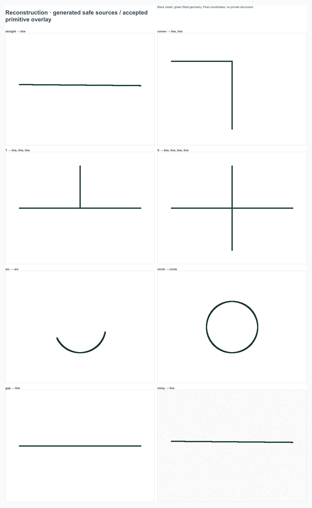

# GeoService real-world release candidate acceptance

Pass date: 2026-10-07/08, local macOS, Node/Chrome, sanitized public `main` b53b26c. Development branch: `codex/real-world-product-hardening`. No push/deployment; public runtime remains the previously published 2be40f3 build. Public pages are independent baseline targets, not this branch.

## Scope and factual capability inventory

Current code implements Point/Line/Polyline/Polygon/Arc/Circle/Text/Labels/Dimensions/Measure; shared vertex editing; marquee, nested primitives and explicit parent selection; Move/Rotate, styles/ByLayer/Match, layers, snapping/grid/ORTHO/Shift. Editor state and canonical commands are in `src/store`, `src/domain`, `src/editor`; imported vector inspection is in `src/vectors` and `deepSelection`.

Views: independent Plan/rotated Plan/North Up/two-point alignment and Axonometric cameras; DXF Paper containers and clipped MODEL viewports with per-viewport freeze. Paper geometry is read-only; active supported MODEL viewport edits canonical Model. View navigation does not enter document history.

Ingestion: coordinate CSV/TXT/TSV, DXF blocks/instances/nested primitives/ATTRIB/source provenance, PNG/JPEG/WebP assets, native-vector/scanned/mixed PDF. Local image workflow has perspective, deskew, metric calibration, reconstruction to Line/Arc/Circle or Polyline fallback, local RU+EN OCR and reviewed repeated-symbol matching. Symbol Library/Ports/Connectors and topology reconstruction are implemented. Complex branched routes remain ordinary geometry.

AI: fixed strict parser schema, local Spatial constraints and derived coordinates, clarification/resume, Document Operations, Process Schemes, local Semantic Teaching/rules. DEV API can use ignored server configuration; static production directly uses the visitor's OpenRouter key. No remote Vision or automatic document context upload.

App: IndexedDB autosave, separate AssetRegistry blobs, Save/Open JSON, PreferencesStore and one Settings Center. Remember-key is explicit separate browser-local storage. Production has relative resources and lazy OCR/PDF/image/topology imports. No collaboration/backend/account subsystem.

Import/reference review found no obsolete production path proven safe to delete: current renderer fallback and DEV API remain intentional; settings exist only in Settings Center. The geometry benchmark's old private-history dependency was obsolete and removed. Typecheck's unused symbol checks supplement, but do not prove whole-module reachability.

## Environments and baseline

A: REAL DEV `http://127.0.0.1:5173/`, isolated test contexts; original user's server left running. B: local relative-base static build `/GeoService/`, no API. C: unchanged [GitHub Pages](https://spnkd.github.io/GeoService/) and [GitVerse Pages](https://spnkd.gitverse.site/geoservice/), isolated Chrome without saved credentials.

Before edits: typecheck/lint/build PASS; official npm registry audit 0 vulnerabilities. Initial unit run concurrent with full E2E: 1206 passed, 82 skipped, 2 five-second timeouts (50k serialization and 300k bounded malformed-provider response). Isolated unit rerun: **1208 passed / 82 skipped**. Initial E2E: **266 passed / 17 skipped / 2 failed** (Axon Z Undo value and DXF dialog report); all five Axon tests passed in isolated rerun before edits. Exact final counts are in the verification section below.

No global timeout inflation. Performance/unit/full browser workloads now run separately. Two exploratory Playwright invocations initially shared their output folder and lost a trace (`ENOENT`); all subsequent runs have unique temporary output directories. This was test orchestration, not application data loss. Initial Axon failures under concurrent load did not recur in isolated rerun or the final complete five-worker run. Contention is suspected, not proven as their root. No production workaround or timeout multiplication was added. Genuine reproduced selection failures above have a separate proven root.

## Acceptance matrix

Rows describe executed workflows; synthetic fixtures are public-safe. Private traces/screenshots stay temporary. PASS means the stated contract, not unlimited import/OCR accuracy.

| Environment / source | Steps and expected behavior | Actual / status | Defect / severity / coverage |
|---|---|---|---|
| A — native editor fixtures | Draw/edit all owners, constraints/snaps, shared dimension vertices, group Move/Rotate/style; one coherent Undo; Save/Open. | PASS in full editor/survey/style/precision suites. | No new defect; `editor`, `survey-tools`, `precision-construction`, `transform-style-toolbar`. |
| A — safe overlapping block/hatch | Hover/click concrete primitive; Ctrl parent; Tab/Shift+Tab; re-click selected ATTRIB and continue cycle. | Initial stationary ATTRIB re-click FAIL; focused regression PASS after fix. | P2: cycle index reset to first overlapping owner while selection retained another ATTRIB. Preserve selected candidate index; `interaction-polish` added regression. |
| A — private local DXF | Import → Model → all Paper containers/viewports → Fit/pan/zoom/rotation; global visibility independent from VP Freeze. | PASS: 5 containers, 15 MODEL viewports, **2/2/3/6/2**. All 15 viewport Fits and Paper Fits leave canonical document/history unchanged. | `viewing-ux`, `hardening-acceptance`, reference `transform-style-toolbar`. No source text/coordinates/screenshot published. |
| A — private local DXF heavy sheet | Activate MODEL viewport, edit line, Undo; exit to Paper, attempt Paper-owned move. | PASS: supported MODEL edit works; Paper command rejected atomically. | `hardening-acceptance`; Paper is not an editable second Model Space. |
| A — private ATTRIB | Structural source attribute → edit/move one instance → Search/provenance → Undo/Redo → parent move → JSON/reload. | PASS after replacing obsolete first-hit/private-string assumptions with Tab and explicit parent action. Other instances and definitions unchanged. | `dxf-attribute-editing` opt-in now contains only a synthetic edited value. Selection fix above also reproduced with synthetic overlap. |
| A — DXF contours/text/table discovery | Supported source geometry/semantic inspection, HATCH priority, 4K/8K rendering, local discovery without inferred placement. | PASS on opt-in rendering/view and full synthetic DXF/table/search suites. | Fidelity is supported source subset; no fabricated placement. Private topology experiment intentionally does not expand nested blocks into engineering objects. |
| A/B/C — safe vector PDF | Import page 1/2, inspect native Unicode, Apply selected content, Search/Properties/Undo/reload; no raster duplicate/OCR route. | PASS; native `ГАЗ V-101 H=28.40` retained. | `geometry-pdf-settings`, topology PDF test; public smoke validates subpath PDF Worker and page chooser. |
| A — safe scanned/mixed PDF | Scan renders locally into image analysis; mixed prefers native vectors; Cancel/Apply/Undo. | PASS: scan adds underlay then staged analysis; mixed creates native owners without raster duplication. | Scan import is a committed underlay step; cancelling later analysis preserves that underlay, not a nonexistent pre-import rollback. |
| A — generated technical raster | Four-corner perspective, deskew confirmation, metric reference, extraction/review → native Apply → semantic Teach → topology. | PASS in image/vectorization/reconstruction and raster topology E2E. | Preview is transient; source underlay remains independent. Apply is one atomic batch. |
| A — 1080p/4K/8K reconstruction | Straight/noisy straight/corner/T/X/arc/circle/small gap; compare raw trace vs fitted result and visually inspect. | PASS: 24 jobs; straight/noisy/gap → one Line, arc → one Arc, circle → one Circle. | No micro-segment regression. Safe visual sheet below and current-only benchmark. |
| A/B/C — local OCR | Real RU+EN runtime; inspect text/confidence, edit region before Apply, Search/Undo/reload. | Workflow PASS; exact recognition has reproduced limitations (below). Four additional Russian labels recognized correctly. | P2 glyph/script/rotation/illumination limits; explicit review and correction, no confidence-as-truth. |
| A — known/rotated/scaled/noisy/unknown symbols | Compare vector-library templates; retain confirmation requirement; unknown/ambiguous must not acquire silent identity. | PASS: four valve matches across 1080p/4K/8K/noisy; repeated unknown has zero library matches. Ambiguous/noise-dropout signatures tested in units. | Known identity is proposed, never automatically committed; image-understanding suites. |
| A — manual/raster/native PDF topology | Port-to-port, T/X, gaps, competing/incompatible ports, complex route, source policy → review/Apply/one Undo. | PASS. Ambiguous/gap requires decision; unsupported connected branch retains source geometry. | `topology-reconstruction`, `topology` units; no new junction/waypoint subsystem. |
| A — REAL Russian corpus | Exact golden + four corner/clearance/route variants + center/relative paraphrases + clarification/semantic/process. | Initial 11/13 PASS; two “трёх” rejections; final **13/13 distinct cases PASS** after targeted rerun. | P1 correctness: scalar provenance recognized digits only. Bounded Russian cardinal literal parser; invented XY remains forbidden; 6 new units. |
| A — REAL golden UI | Generate exact historical request, inspect assumptions/8 ghosts, Apply, verify locally derived (17,3)/four dimensions, one Undo. | PASS with REAL DEV provider; preview does not mutate document. | `rc-real-ai` opt-in; browser request contains only text. |
| A — clarification | Two named roads, orientation/routing ASK; choose structured answer; same original prompt; local resume/Cancel. | PASS deterministic E2E; REAL orientation end-to-end PASS, exactly two DEV parse requests for golden and ambiguity combined. | Local answers make no second call; provider-level clarification separately transmits bounded user answer only. |
| A/B/C — AI failure/no-key state | Auth/429/network/timeout/malformed/truncated/unsupported/invalid/stale/cancel, then recover; no-key editor usable. | PASS in reliability suites and production no-key smoke. | No silent mock/fallback to fabricated plans, no partial Apply. DEV intentionally exposes collapsed diagnostics; production does not. |
| A — composite torture | Manual geometry/shared point, styles/layers/dimension/ATTRIB, symbols/connectors, AI geometry, semantic rules, raster, image line/OCR, PDF line, reconstructed Connector. | PASS: 11 exact Undo/Redo revisions, connectivity/provenance/Search indexes; autosave/reload/JSON Save/Open exact; missing raster relink preserves nonraster content. | `release-torture` units and `rc-hardening` browser test. Safe fixture only; not a claim of remote OCR on every composite revision. |
| A — pagehide/save/quota/asset failure | Flush pending commit, inject failed writes, inspect previous record/status, edit again. | Initial flush stuck Saving; after fix saved/error reports actual completion. Quota preserves old record; later save recovers. Asset failure creates no orphan owner. | P1: pagehide called save without success/error handling. Both paths now share revision-guarded completion. Three focused regressions plus asset test. Hard browser process termination cannot guarantee asynchronous flush. |
| A — corrupt/missing inputs | Invalid/future JSON, corrupt preferences, DXF/coordinate/image/PDF and Worker errors, missing asset. | PASS recoverable UI in relevant suites; committed document retained except explicit replacement. Placeholder/relink works. | Existing strict validation, bounded resource errors and Cancel guards. No white screen/unhandled rejection observed. |
| A/B/C — Settings/preferences/key | Change model/snap/grid/tab; reload; Remember off/on/off, verify document unaffected. | PASS; key disappears by default, explicit separate device key can survive, revocation immediate. | `geometry-pdf-settings`, preferences/browser-AI units and Pages smoke. Local storage is not OS keychain. |
| A — shared Dialog/popover/focus | Outside/peer/action/Escape dismissal, trap/restore/scroll; pointer selector then Space pan; Search/AI whitespace; 1000×700 desktop. | PASS in shared UI suites and added dialog cases. Right tab/panel association corrected. | P2 missing tabpanel/aria-controls/label linkage. Test resize race corrected by choosing viewport before startup; no ad-hoc listeners or CSS redesign. |
| B/C — no backend static deployment | Relative resources, no eager OCR/PDF, first-use Workers/OCR, no-key onboarding, REAL direct browser AI. | Both public hosts **14/14 checks PASS**, no API/backend call, no unexpected external request/error/404. Local static smoke reported separately below. | Public version unchanged; isolated Chrome avoids known external profile block. |

## Fixed defect roots and regression evidence

P1 autosave: pagehide used `void saveAutosave` without completion/error processing. A successful write left Saving; a quota write also left Saving. A shared `persistCommitted` callback checks current revision and actual transaction completion for both debounce and flush. Live serialization errors now say the open document remains available instead of falsely claiming a demo was opened. Before-fix tests failed twice; three after-fix regressions pass.

P1 AI numeric provenance: correct REAL anchored intent with three-metre clearance was rejected because validation recognized only digit literals. `numericLiterals` recognizes explicit bounded Russian cardinal forms/compound tens, without parsing spatial phrases or manufacturing XY. Tests forbid interpreting thirty-three as permission for three and retain invented-coordinate rejection. Both failing REAL cases subsequently RESOLVED.

P2 selection: a stationary pointerdown on an existing ATTRIB retained that attribute but reset `normalCycle.index=0`. If another owner ranked first, the cycle's eligibility check compared mismatching owners and Tab became native focus navigation. Align the cycle index with the retained attribute. The synthetic regression fails before and passes after; reference edit/parent workflow passes.

P2 accessibility: editor tabs had `role=tab` without panel association. Add stable tab IDs/aria-controls and labelled `tabpanel` roles on the mounted surfaces; drafts remain mounted and hidden panels remain hidden. Added exclusive-panel regression and updated role-based tests.

## Image/OCR/reconstruction evidence

[Safe generated reconstruction overlay](screenshots/reconstruction-acceptance.png): black raster versus green accepted fitted primitives, inspected visually. No private source appears.

Straight trace 732–736 raw points → one Line/two vertices; noisy straight does the same. Maximum straight/noisy residual 1.18 analysis px, median ≤0.38 px. Corner → two Lines; T → three; X → four; true arc/circle each retains native primitive. All 24 measured jobs have no external request/browser error/main long task in the observed interval. These generated fixtures do not prove every scanned drawing can be reconstructed faithfully.

Real OCR examples, 1080p/4K/8K: ГАЗ/ВОДА always exact (96 engine confidence). ТК-3 often `TK-3` (88–91); H=28.40 can become Cyrillic Н (88–90); V-101 misreads once at 4K (84); Ø57 becomes O57/(057 (82–88). Rotated adjacent labels can merge. Global threshold on uneven-lighting fixture detects only two regions; adaptive lighting is available and checked in E2E. Extra generated `ТРУБА ГАЗА`, `ВВОД ВОДЫ`, `КРАН-12`, `РЕГУЛЯТОР ДАВЛЕНИЯ` recognized exactly (91–96). Scores are not calibrated correctness probabilities. Review/edit is mandatory for canonical Text.

Recognition wall time in six initial jobs: OCR 0.25–0.44 s, symbol matching 0.08–0.11 s; later extended run reports are authoritative raw measurements. Source decoder bitmap estimated up to 132.7 MB for 8K, analysis RGBA bounded by 1200 edge. Crop/OCR caps and sampled JS heap do not measure native decoder/WASM peak RSS. No claim of peak memory independence from source dimensions.

## AI, clarification and privacy

[REAL corpus report](audit-results/release-real-ai.json): requested/actual model `qwen/qwen3.5-27b`; observed providers DeepInfra/Phala; final case latencies 3.478–39.769 s. 15 upstream HTTP attempts for 13 distinct cases including two targeted retests. Semantic pipes selection resolves locally; process resolves to six symbols/five connectors.

Golden resolves locally: 20×30 local plot, NW 5×6 house at (3,21)–(8,27), SE valve (17,3), boundary route to house, four dimensions. Provider proposes constraints/actions; derived point provenance is RESOLVER_DERIVED. Eight accepted owners in one batch and exact Undo were verified through REAL UI.

REAL UI orientation case shows a structured question, chooses MODEL, restores the same plan/original prompt, enables two-object Apply and Cancel leaves document unchanged. Local clarification incurs no extra parse call. Deterministic tests additionally cover duplicate named roads and routing choices.

Network observations: non-AI DXF/PDF/image/OCR/Teach/topology/persistence uses same-origin static assets/Workers/local browser storage only. Production AI bodies have exactly model/max_tokens/messages/provider/reasoning/response_format/temperature; message roles system/user, user message is the typed text. Fixed parser schema/instructions accompany it. DEV bodies contain text, optionally structured clarification answers. No document catalog, geometry, vertex coordinates, source bytes, screenshot, selected IDs, rules, history or preferences is automatically sent. Explicit user-typed coordinates are part of transmitted text. API keys are headers only; their values are never captured in reports. Documents and key storage remain separate.

Task REAL count: **21 logical requests** (15 corpus attempts including retests, two DEV golden/clarification parses, two connection checks and two browser plans on public hosts). Corpus/browser upstream attempts are recorded; the two DEV UI upstream transports were not independently counted, so this is not an assertion of exactly 21 upstream HTTP attempts if server retries occurred.

Private reference stays local; only neutral counts/timings were retained. New fixtures/reports/screenshots contain generated or synthetic data. Final tracked-history/build privacy audit is recorded in verification.

## Performance and generous budgets

Three fresh 1440×900 Chrome DEV contexts on the private reference; driver feedback includes Playwright and two rAFs, not pure input latency. Inclusive 1 ms CPU samples and React actualDuration are approximate; render duration is not commit duration. No 60 FPS claim. [Interaction report](audit-results/interaction-polish-rc.json) records event/frame/Paint/Canvas/React/hit-stack/long-task evidence. Full trace stays private. Search includes its deliberate debounce.

Initial three-run median p95 Canvas draw: Model pan 9.1 ms / zoom 8.2; rotated Plan 8.6/8.1; heavy Paper 0.6/0.6; active MODEL viewport 5.8/6.9. Pan/zoom/hover stages had zero >50ms tasks. Dense click/Properties stages had 2–4 median long tasks with driver p95 117–146ms; these are recorded P2 rather than hidden by a rewrite. Final Fit driver p95: Model 144 ms, rotated 117 ms, Paper 106 ms, active viewport 121 ms. Debounced Search p95 583 ms, including a fixed 230 ms driver wait; it also produced 12 median long tasks over six alternating queries. These are measured P2 inspection/search costs, not pan/zoom stalls. Final Canvas p95 Model pan/zoom 7.8/7.6 ms, rotated 7.8/7.9, Paper 0.6/0.7, active 6.3/7.0. The final report supersedes the earlier timing values.

Budgets catch material regressions, not scheduler noise: reference Canvas p95 ≤40ms Model/rotated, ≤20ms Paper, ≤40ms active viewport; driver pan/zoom/click/Tab p95 ≤500ms; debounced Search ≤1500ms; Fit ≤1500ms; small local Spatial solve+preview ≤50ms (existing automated 20-sample test); generated image extraction wall ≤5s/recognition ≤30s; topology fixture ≤500ms local analysis; composite autosave/reload ≤10s; 50k-document encode/hydrate ≤15s. Hardware/network context must be recorded. Do not apply a public network latency threshold as a deterministic CI CPU test.

## Bundle/startup and production evidence

Before main entry 916.02 kB / 273.70 kB Vite gzip; final after focused fixes 918.56 / 274.56. No splitting/renderer rewrite attempted: heavy feature resources already lazy, measured production startup remains usable. [Bundle report](audit-results/release-bundle.json) stores file bytes and Python gzip (compression differs slightly from Vite/HTTP). PDF UI+parser ~422.6 kB, recognition Worker ~132.9, image dialog ~30.1, topology dialog ~18.9, semantic dialog ~10.2; PDF Worker/OCR languages/cores are first-use resources.

[Public startup](audit-results/release-startup.json), three isolated contexts per host: GitHub usable editor 1.214–1.583 s; GitVerse 2.790–3.460 s. HTML/main response sizes and timings are recorded; OS/CDN cache and network variability remain. No eager PDF/OCR/image/topology/semantic feature resource or unexpected error/404. Settings code remains part of main; removing the >500k warning alone was not a product objective.

[GitHub smoke](audit-results/release-github-pages.json), [GitVerse smoke](audit-results/release-gitverse-pages.json): each 14 checks, REAL connection/structured plan, no-key UX, remember-key semantics, preferences, native editing/Undo/storage, DXF, PDF, scan/image Worker, real local OCR, topology Apply. Production makes no `/api/ai` request. Only explicit AI contacts OpenRouter. Normal profile GitVerse block remains external; no browser security configuration altered.

## Verification and release decision

Final unit: **1216 passed / 95 skipped** (48 files passed / 7 skipped). Full Chrome E2E: **281 passed / 18 skipped**, 299 cases, five workers, 3.3min. REAL opt-in UI: 1 passed. Eight distinct private opt-in scenarios PASS with selective reruns. Additional reconstruction 24 jobs and extended OCR/symbol 11 jobs PASS as workflows, with recognition limits documented. Typecheck/lint/build PASS; official npm audit **0 vulnerabilities**. Local static 13 checks and both public hosts 14 each PASS. Unexpected console/page error, missing static resource and unexpected external upload checks: zero in those instrumented runs. Tracked-history/dist privacy scan PASS: zero matches for the exact configured key and audited private-reference markers; ignored local credentials and private source/trace/screenshot files remain outside tracked artifacts. The final committed HEAD is scanned again after the documentation commit; no push/deployment. This bounded marker scan complements reviewed safe artifacts and payload-category audits, not a universal proof against every possible secret. See [release checklist](RELEASE_CHECKLIST.md) for reproducible commands and [known issues](KNOWN_ISSUES.md) for current P2/Future boundaries.

No publication is authorized by this pass. Release recommendation is made against local hardening HEAD after the final gates; it does not imply the public hosts include these fixes.

### Large persistence observation

[50k native owners](audit-results/release-persistence.json), safe generated coordinates: 10,830,416 canonical bytes; validation/encoding preparation Worker 271ms, separate IndexedDB put 59ms, actual UI Open-to-saved 5.22s, Save/download wall 2.01s, reload-to-saved 3.84s. Canonical SHA-256 comparison confirms exact Save/Open/reload equality for all 50k owners, no console errors. Main-thread tasks reached 1.910s during materializing/native rendering/explicit JSON work. This capacity-limit behavior is a reproducible P2; it is not presented as smooth interaction. Existing Worker autosave is responsive, but full native scene rendering and explicit JSON operations remain costly. A renderer/persistence redesign was not undertaken in this feature freeze.

Supplemental private source inspection: LINE/LWPOLYLINE/HATCH and TEXT/MTEXT/nested primitive/parent were exercised in isolated owner views sourced structurally from the local import, complementing full-document navigation and ATTRIB tests. [Neutral report](audit-results/dxf-ux-reference.json) contains counts/booleans/types only. Topology reference report excludes even source-derived tolerance distances.

### Final local static and private wheel checks

Local production `/GeoService/`: 13/13 checks PASS using deterministic browser AI transport (no external provider); actual native/scanned PDF Workers, local RU/EN OCR, topology, Save/reload and key/preference semantics all pass. Private reference SVG fallback wheel saturation and edited >10MiB Save/New/Open: PASS in 1.1min, source-free audit only. This complements the Canvas pan/zoom benchmark rather than conflating two renderers. Eight distinct reference scenarios passed with selective reruns after their source-specific assumptions/reporting were removed.

Release recommendation: **READY FOR BROADER MANUAL TESTING**. No known P0/P1 remains from this pass; reproduced P2 OCR, bundle, dense inspection/search and 50k capacity costs are explicit. This is bounded acceptance, not import/OCR completeness or accessibility certification. Next major direction suggested by retained complex topology routes: faithful Connector waypoints/route representation, developed in a separate feature slice.
